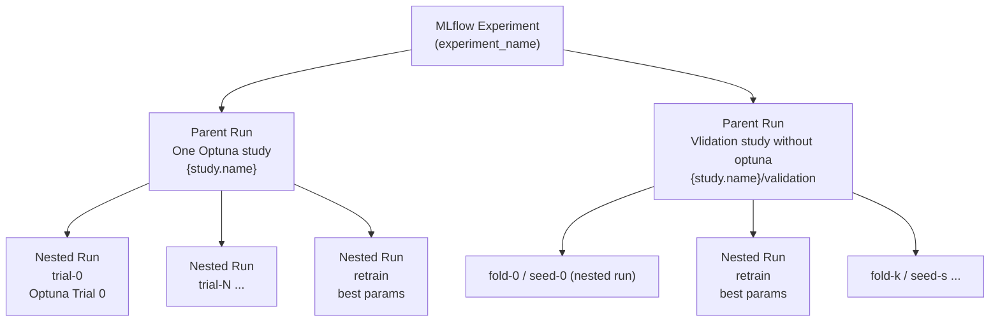

# Experiments

ML experiments for eye disease classification. Optuna for the
hyperparameter search, PyTorch Lightning for training, MLflow (Postgres backend)
for tracking. Every training is reproducible from a static JSON config.

## Setup

```bash
uv sync
```

## Setup pre-commit checks

```bash
# requires installing pre-commit package
pre-commit install
```

Requires a `.env` at repo root with MLflow and Postgres credentials (see
`src/experiments/lib/mlflow_setup.py` for the variables it reads). The dataset is
downloaded from an authenticated server on first run.

## Layout

- `src/experiments/experiment/` - `studies/`, `models/`, `datamodules/`
- `src/experiments/lib/` - common libs
- `src/experiments/cmd/` - entry points
- `packages/` - submodules

## Usage

Run entrypoints:
```bash
uv run -m experiments.cmd.<name>
```

## Config-driven

Everything configurable is a `ClassConfig` (`lib/config_serializing.py`):
`config.build()` instantiates the class it configures. Configs are serializable
to json using `to_json`/`from_json`.
The study config is logged to MLflow as an artifact so a finished
study can be rebuilt for validation.
Mark a field with `OptunaOptimised(...)` to put it in the search space.

## Components and what each system calls them

The words "experiment", "study", "run" mean different things in Optuna, MLflow,
and our code. Anchor on the actual entity in the pipeline; the columns are the
name it goes by in each place.

| Entity | Optuna | MLflow | Our code |
|--------|--------|--------|----------|
| Server connection (MLflow + Postgres + Optuna storage) | `RDBStorage` | `MlflowClient` | `Experiment` (`lib/mlflow_setup.py`) |
| Named batch grouping all related runs | RDBStorage | Experiment (`experiment_name`) | `experiment_name` string |
| One hyperparameter search (one model+config, N trials) | Study (`study_name` = `study.name`) | parent run (name `study.name`, tag `optuna_study`) | `Study` + `StudyConfig`; |
| One training with a sampled param set | Trial (number) | nested run `trial-N` (tag `optuna_trial`) | `_objective` -> `_train`; `trial` |
| Retrain of the best params to its best epoch | - | nested run `retrain` | `_retrain` |
| One validation sample | - | nested run `fold-i` / `seed-s` (tag `validation_sample`) | `validate_fold` / per-seed `_retrain` |

Cross-links: an Optuna trial points at its MLflow run via the trial user-attr
`mlflow_run_id`; an Optuna study points at its parent run via the study user-attr
`mlflow_parent_run_id`.

Name clashes to watch:
- `Experiment` (our connection class) is **not** the MLflow experiment (the
  grouping). Same word, two unrelated things.
- One hyperparameter search is called a Study (Optuna), a parent run (MLflow),
  and `Study`/`study.name` - one entity, three names.
- "Run" is MLflow-only; Optuna's unit is a Trial.


